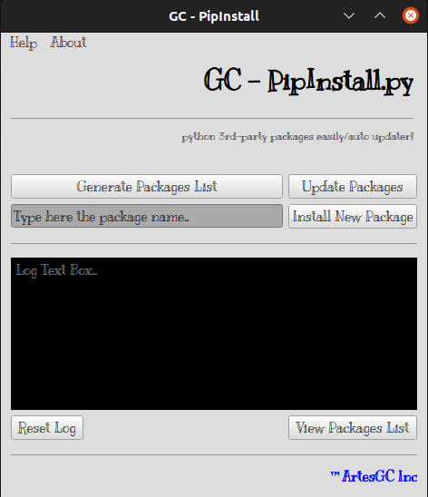

# 

 \

 

    I introduce to you the scripts that 
    easily upgrade all the 3rd-party modules
    installed on your python virtual environment (pip)

- it gets the module list generated by the `pip list` command;
- then save it in a file located on `.list/packages.txt`;
- with his content organized by `module_name>=version_installed`;
- it also update the modules through the `pip install --upgrade -r packages.txt` command;
- and even allow you to install new packages;

## Screenshot

---

&copy; 2019-2022 Nurul-GC \
&trade;ArtesGC Inc.
